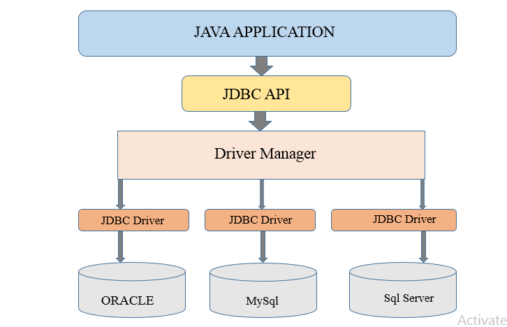

# JAVA SE: SQL Y BASES DE DATOS

## JDBC Driver: 

El JDBC Driver es un componente de software que permite la conexión y la comunicación entre una aplicación Java y una base de datos. Actúa como un puente entre la aplicación y el sistema de gestión de bases de datos (SGBD). Cada SGBD tiene su propio controlador JDBC específico que debe ser utilizado para establecer la conexión y realizar operaciones en la base de datos. El JDBC Driver es responsable de traducir las llamadas de la API JDBC a instrucciones SQL comprensibles por el SGBD, así como de enviar y recibir resultados de las consultas.

## JDBC Driver Manager:

 El JDBC Driver Manager es una clase proporcionada por el JDK (Java Development Kit) que actúa como un administrador de controladores JDBC. Su función principal es administrar y seleccionar el controlador adecuado para establecer la conexión con la base de datos. El Driver Manager carga dinámicamente los controladores disponibles en tiempo de ejecución y permite a la aplicación seleccionar el controlador apropiado según la URL de conexión proporcionada. También se encarga de abrir y cerrar la conexión con la base de datos.

## Origen de datos (Data Source): 

El origen de datos representa la base de datos con la que se comunica la aplicación Java a través de JDBC. Puede ser una instancia específica de un SGBD o un conjunto de conexiones configuradas para acceder a una base de datos.

En resumen, el JDBC Driver es responsable de la comunicación directa con la base de datos, el Driver Manager administra los controladores y selecciona el adecuado, y el origen de datos representa la base de datos.

# Indice
1. [JBDC](./1.%20JDBC.md)
2. [DAO y Repository](./2.%20Patron%20DAO%20y%20Repository.md)
3. [Transacciones]()